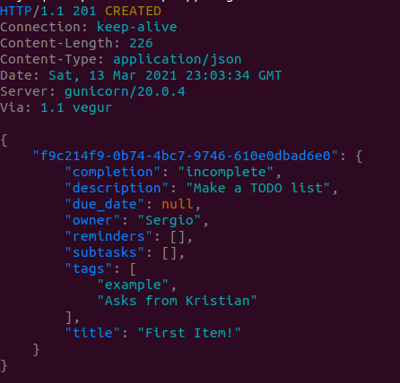
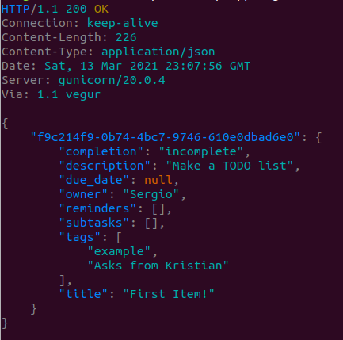
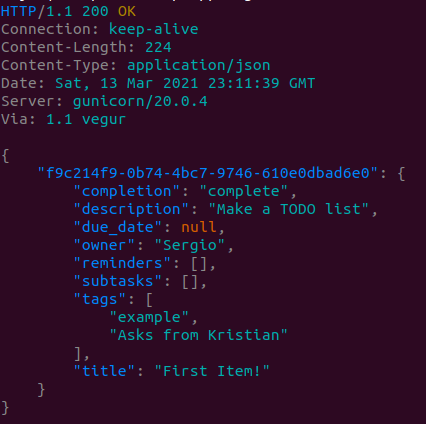
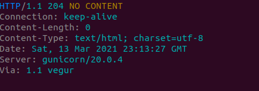

# A Todo List Backend

Public URL: https://sergio-todolist-for-northone.herokuapp.com/


## Example Usage:

These examples use httpie: `sudo apt install httpie`. If you prefer cURL or Postman, adjust the requests to your needs.


### Create a new item:

```
echo '{
    "title": "First Item!",
    "description": "Make a TODO list",
    "completion": "incomplete",
    "due_date": null,
    "reminders": [],
    "tags": ["example", "Asks from Kristian"],
    "owner": "Sergio",
    "subtasks": []
}' | http POST https://sergio-todolist-for-northone.herokuapp.com/api/todos
```



### List all items:

```
http GET https://sergio-todolist-for-northone.herokuapp.com/api/todos
```



### Update an existing item:

```
echo '{
    "title": "First Item!",
    "description": "Make a TODO list",
    "completion": "complete",
    "due_date": null,
    "reminders": [],
    "tags": ["example", "Asks from Kristian"],
    "owner": "Sergio",
    "subtasks": []
}' | http PUT https://sergio-todolist-for-northone.herokuapp.com/api/todos/f9c214f9-0b74-4bc7-9746-610e0dbad6e0
```



### Delete an item:
```
http DELETE https://sergio-todolist-for-northone.herokuapp.com/api/todos/f9c214f9-0b74-4bc7-9746-610e0dbad6e0
```



### Delete all complete items:
```
http DELETE https://sergio-todolist-for-northone.herokuapp.com/api/todos/all-complete
```
Output not shown. You get the idea by now


## Future work

With time, I could add a lot more. Some examples:

* Sorted or filtered results by tag, completion, owner, etc
* Request schemas
* Email or SMS reminders, using Twilio for example
    * Notifications from the browser could be implemented client-side
* Adding created_at field and a notify_threshold, we could reminder users of tasks that may have been forgotten
* The ability to freely re-arrange items. Interestingly, that was not a requirement ;)
* Multiple users, where each user can only see their own items
* If lists became large:
    * Pagination
    * A calendar view API (while list is small, it's faster to fetch all items and let the front-end produce a calendar view)
